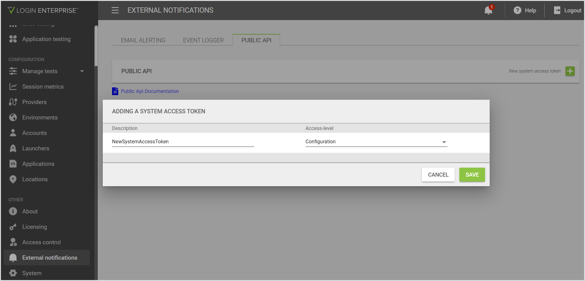

# SPECviewperf GPU Benchmark Workload

## What’s new (Aug 2025)

**Automatic clock-drift correction** and **secure Application credential injection** have been added.

- The workload now measures local vs. appliance clock drift automatically and aligns all SPECviewperf timestamps to server UTC — no manual `timeOffset` required.
- Use Application Credentials (Application **Username** for the viewset, Application **Password** for the configuration access token) to avoid hard-coding secrets.

## Overview

This workload automates the execution of SPECviewperf (SVP) benchmarks and uploads the results as Platform Metrics to Login Enterprise. It provides an objective and standardized benchmarking process that is quick to configure, yielding valuable insights for baselining, performance comparisons, and configuration assessments.

For additional details, see the [Knowledge Base article](https://support.loginvsi.com/hc/en-us/articles/16878931711004-SPECviewperf-GPU-Benchmark-Workload).

**Key Features:**

- **Self-contained Execution:** Runs specified SPECviewperf viewsets and handles results automatically.
- **Data Integration:** Uploads benchmark results as Platform Metrics to Login Enterprise.
- **Quick Configuration:** Requires minimal setup by updating variables at the top of the script.
- **Objective Analysis:** Facilitates easy comparison across different GPUs, environments, and configurations.

**Note on Terminology:**

In this document, the terms **script**, **workload**, and **Login Enterprise Application** are used interchangeably, all referring to the `specViewPerf_Benchmark.cs` file that automates the benchmarking process.

## Script Workflow

The script performs the following steps:

1. **Check and Terminate Existing Processes**
   - Checks if `runviewperf.exe` or `viewperf.exe` processes are already running.
   - Optionally terminates existing processes if configured to do so.

2. **Archive Existing Results**
   - Moves any existing `results_*` directories (previous SVP test run(s)) from the SPECviewperf directory to an archive directory.
   - Ensures no residual result directories remain after archiving.

3. **Run SPECviewperf**
   - Initiates the `RunViewperf.exe` process with the specified viewset and resolution.
   - Confirms the process starts within a specified timeout period.
   - Records the start timestamp upon process initiation.
   - Monitors the process until completion, enforcing a maximum runtime limit.
   - Records the end timestamp when the process concludes.

4. **Create Start and End Event**
   - Logs an event containing the start time, end time, viewset name, and host/user information.

5. **Check for Results and JS File**
   - Waits for the `results_*` directory to be created after benchmarking.
   - Locates the `*.js` results file within the directory.

6. **Wait for the JS File to Be Ready**
   - Monitors the `*.js` file to ensure it is fully written and stabilized in size before proceeding.

7. **Parse JS File**
  - Parses the `*.js` file to extract benchmark data.
  - **Automatically measures and corrects clock drift** by contacting the Login Enterprise appliance (reads the HTTP `Date` header and applies a half-round-trip correction), then converts captured local timestamps to server-aligned UTC before uploading. No manual `timeOffset` is required.
  - Prepares the data for uploading to Login Enterprise.

8. **Generate PowerShell Script**
   - Creates a PowerShell script to upload the benchmark data to the Login Enterprise API.

9. **Upload Platform Metrics**
   - Executes the PowerShell script to upload the data as Platform Metrics to Login Enterprise.

## Configurable Variables

Update the following variables at the top of the script to match your environment:

- **`timeOffset` — _no longer required_**
  - **Removed:** You do **not** need to set `timeOffset` manually.
  - The script now performs an automatic clock-drift check against your Login Enterprise appliance before each run: it measures round-trip time using the appliance HTTP `Date` header, computes a half-round-trip correction, and converts local SPECviewperf timestamps to server-aligned UTC (Zulu) automatically. Leave `timeOffset` unset.

- **`configurationAccessToken` / secure credentials**
  - **Do not hard-code** API tokens in the script. Instead, use Login Enterprise **Application Credentials**:
    - Put the SPECviewperf **viewset name** in **Application Username**.
    - Put the Login Enterprise **configuration** system access token in **Application Password**.
  - The workload reads `ApplicationUsername` and `ApplicationPassword` at runtime and injects them into the script securely. For details on configuring Application Credentials, see: [Applications: Scripting secure Application credentials](https://support.loginvsi.com/hc/en-us/articles/360001341979-Applications#h_01JASRQ2N7HX5RJT9M5C4BTPVX).
  - Environment variable fallbacks are still supported but are less secure than Application Credentials.

    

- **`string baseUrl = "https://myLoginEnterprise.myDomain.com/";`**
  - The base URL of your Login Enterprise instance, including the ending slash.

- **`string environmentId = "**********";`**
  - Your environment key/ID in Login Enterprise. To obtain:
    1. Log into Login Enterprise.
    2. Navigate to **Configuration** > **Environments**.
    3. You have two options:
       - **Option A:** Use an existing Environment.
         - Click on the desired environment.
         - The environment ID is the unique identifier at the end of the browser's address bar URL (e.g., `3221ce29-06ba-46a2-8c8b-da99dea341c4`).
       - **Option B:** Create a new Environment.
         - Click **Add Environment**.
         - Fill out the required information (only **Name** is necessary).
         - Click **Save**.
         - After saving, the unique environment ID will be at the end of the browser's address bar URL.

    

  - For more information on Environments, see the [Environments](https://support.loginvsi.com/hc/en-us/articles/7946104119324-Environments).

- **`string viewsetName = "snx";`**
  - The SPECviewperf viewset to run. Examples include `"snx"`, `"sw"`, `"maya"`, etc.

- **`string resolution = "1920x1080";`**
  - The resolution for the benchmark. Options include resolutions like `"1920x1080"` or `"native"`.

- **`string svpDirPath = @"C:\SPEC\SPECgpc\SPECviewperf2020";`**
  - The installation directory path for SPECviewperf and `RunViewperf.exe`.

## Setup Steps

Before running the script, perform the following setup steps:

1. **Upload the Workload Script:**
   - Import the `specViewPerf_Benchmark.cs` script to Login Enterprise under **Configuration** > **Applications**.

   

2. **Configure Application Credentials (recommended):**
  - In the Login Enterprise UI under **Configuration → Applications**, edit the Application used for this workload and add Application Credentials.
  - Put the SPECviewperf *viewset name* in **Username** and your *configuration* system access token in **Password**.
  - This keeps tokens encrypted and avoids editing the script directly. See the Applications KB for instructions.

## Prerequisites

- **Login Enterprise Version:** This script has been tested with Login Enterprise version 5.13.6.
- **SPECviewperf Installation:** SPECviewperf must be installed and properly configured on the target machine.
- **SPECviewperf Licensing:** Before installing and using SPECviewperf for this testing, review your SPECviewperf licensing agreement to ensure correct licensing for this usage.
- **Access Tokens and IDs:** Obtain a configuration access token and environment ID from your Login Enterprise instance.
- **TLS / Certificates (lab vs production):** For lab/self-signed deployments the script temporarily bypasses certificate validation during the drift check and upload steps. For production, ensure the appliance presents a valid TLS certificate or remove the bypass in the script. Regardless, keep API tokens in Application Credentials rather than embedding them in scripts.

## Benefits

- **Quick Configuration:** Minimal setup required. Update a few variables, and you're ready to run the benchmark.
- **Objective Benchmarking:** Utilizes SPECviewperf for standardized GPU performance metrics.
- **Data Integration:** Automatically uploads results as Platform Metrics to Login Enterprise for centralized analysis.
- **Performance Analysis:** Facilitates baselining and comparative analysis across different environments, GPUs, and configurations.

## Examples of Benchmarking Results

### Hourly View

*Figure: Platform Metrics displayed over an hour timeframe.*

### Daily View

*Figure: Platform Metrics displayed over a day timeframe.*

**Note:** All displayed timestamps are aligned to appliance UTC using automatic clock-drift correction so Platform Metrics correlate precisely with other platform events (EUX, VSImax, etc.).

## Notes

- Modify the configurable variables at the top of the script to suit your environment.
- Ensure that the target machine meets all requirements for running SPECviewperf.
- The script includes error handling to gracefully handle unexpected conditions.

## Additional Information

- **Method Breakdown:**
  - The script uses nested methods within the `Execute()` method, each responsible for a specific part of the workflow, as detailed in the [Script workflow](https://support.loginvsi.com/hc/en-us/articles/16878931711004-SPECviewperf-GPU-Benchmark-Workload#h_01JCHAXJ6QNP4TVJ5MEARTW46S).
- **Best Practices:**
  - The script follows best practices regarding error handling, resource management, and modular code structure.
  - Variables are clearly defined and documented for ease of configuration.

## Conclusion

This workload script provides an automated and efficient method for running SPECviewperf benchmarks, processing the results, and integrating them into Login Enterprise for comprehensive analysis. It streamlines the benchmarking process, enabling quick configuration and immediate value in performance monitoring and comparative assessments.

---

© 2024 Login VSI. All rights reserved.

The information provided in this document is subject to change without notice. Login VSI assumes no responsibility for any errors that may appear in this document.

---

Please ensure to adhere to your organization's policies regarding script usage and data handling.

If you have any questions or need further assistance, contact our support team at [support@loginvsi.com](mailto:support@loginvsi.com).
