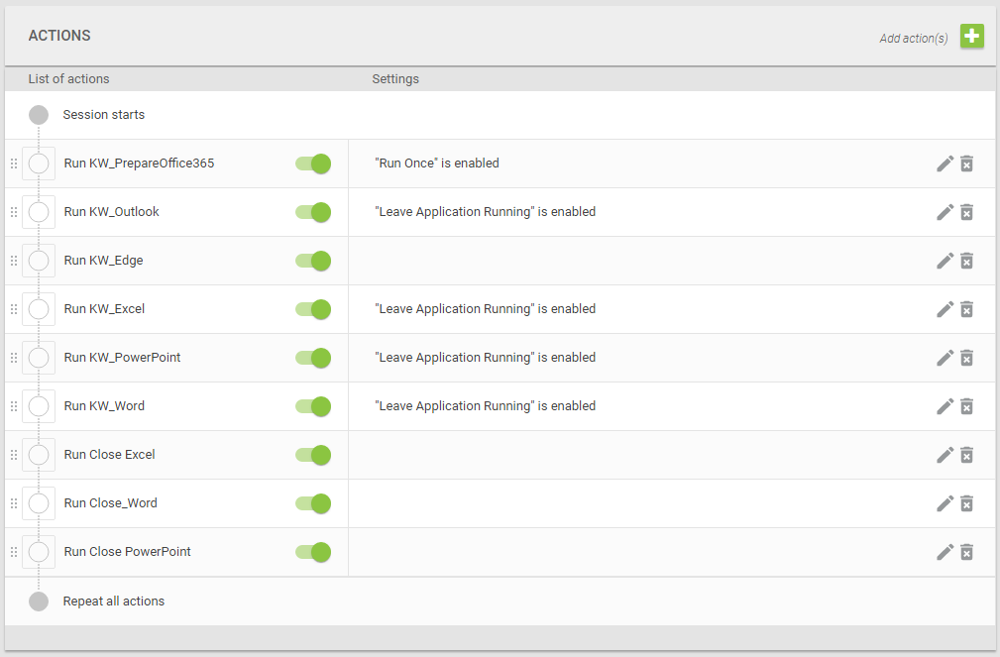

# Knowledge Worker

| Name | Login Enterprise Knowledge worker |
|--|--|
| Version | 1.0 |

## Description
The Knowledge Worker is designed for 2(v)CPU environments. This is a well-balanced intensive workload that stresses the system smoothly, resulting in higher CPU, RAM and IO usage.

This document describes how to import this workload work with it. In this folder you can also find a PDF visualizing the flow and actions of the workload.

## Using the workload
Using the workload is done by creating an application group. Within this application group a set of applications is defined in a specific order with specific application properties enabled. The applications need to be imported separately. After this process the application group can be added to any test.

*Note: This can also be done directly in a test*

## Configuration

Each application is represented as a separate script file. Per script file you need to:
1. Create the application with the type and target noted at the start of the .cs file (or take it from the table below)
2. Upload the script file to the application

The applications then need to be placed inside an application group. They need to be placed in the order and with the properties defined below.

| Application | Run once | Leave application running | Type | Target
|--|--|--|--|--|
| KW_PrepareOffice365 | Enabled | Disabled | Windows Application | winword.exe
| KW_Outlook| Disabled | Enabled | Windows Application | outlook.exe /importprf %TEMP%\LoginPI\outlook.prf
| KW_Edge | Disabled | Disabled | New Microsoft Edge | N/A
| KW_Excel | Disabled | Enabled | Windows Application | excel.exe
| KW_PowerPoint | Disabled | Enabled | Windows Application | powerpnt.exe
| KW_Word | Disabled | Enabled | Windows Application | winword.exe
| KW_Close Excel | Disabled | Disabled | Windows Application | excel.exe
| KW_Close PowerPoint | Disabled | Disabled | Windows Application | powerpnt.exe
| KW_Close Word | Disabled | Disabled | Windows Application | winword.exe

An example of a configured application group:

