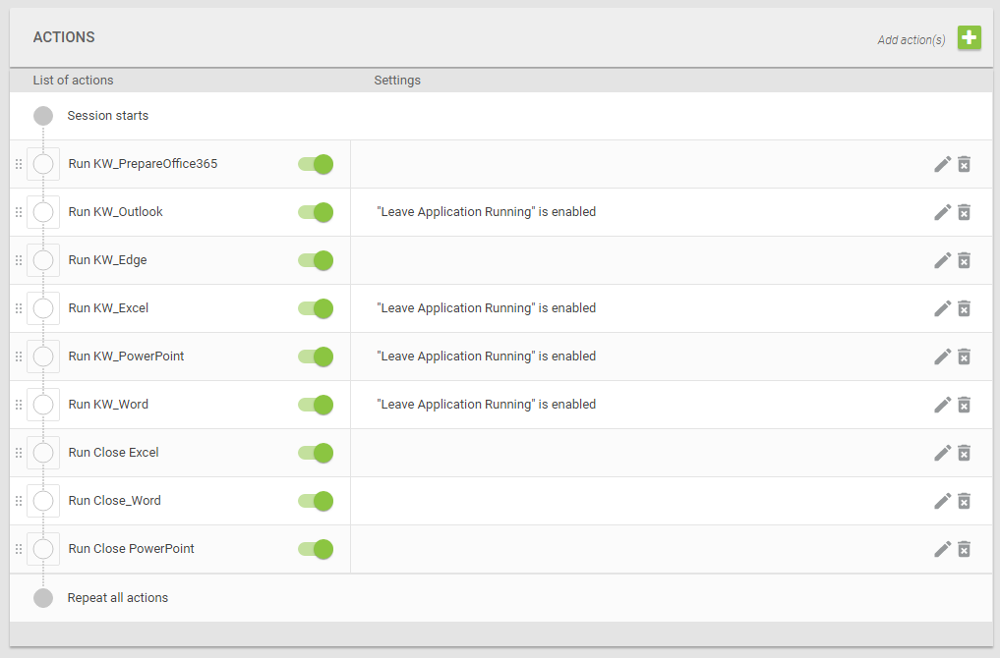

## Knowledge worker

This folder contains all scripts of the default knowledge worker for Login Enterprise tests.
There is a file for each application script to be used.
Each script file contains a header describing the application settings that should be used

Configure your schedule as depicted in the following screenshot:

*Note: This can be done either directly in the test or as an application group*
